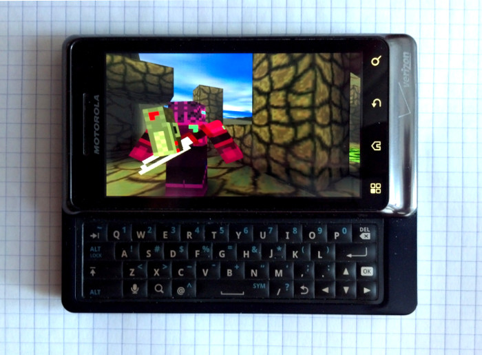
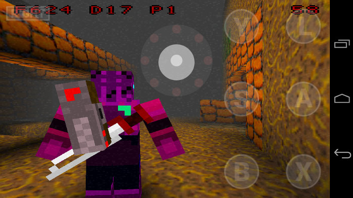
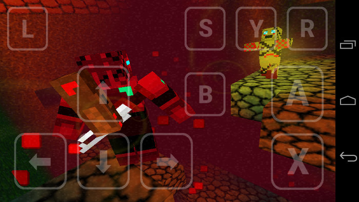
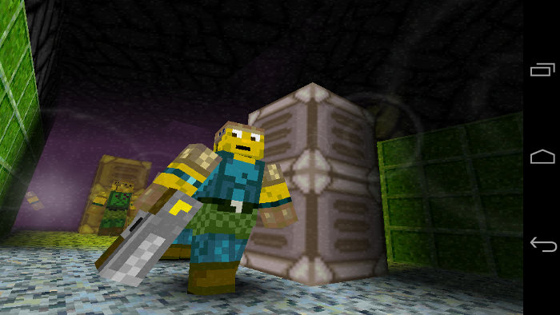

Adamant Armor Affection Adventure
=================================

Adamant Armor Affection Adventure by quasist and Don Miguel is a 3D stealth-action platform game participated in the [RIOT Tag-Team Coding Competition](http://www.riotdigital.com/ttcc2011/?page=Blog) event in 2011 and took the second place. It was originally released on the gaming console GP2X Caanoo and GP2X Wiz, and later ported to Pandora and GCW Zero.



This is my port of Adamant Armor Affection Adventure to Android OS with using SDL2 and SDL2_mixer libraries and rendering the videocontext of the game with using OpenGL ES. I added simple touch controls and some other improvements to the game engine.







[Adamant Armor Affection Adventure port on Motorola Photon Q video on YouTube](https://www.youtube.com/watch?v=8UfZP2pbrOg)

## Download

You can download APK-package for Android OS from the [releases](https://github.com/EXL/AdamantArmorAffectionAdventure/releases) section.

## Build instructions

For example, GNU/Linux:

* Install the latest [Android SDK](https://developer.android.com/sdk/) and [Android NDK](https://developer.android.com/ndk/);

* Clone repository into deploy directory;

```sh
cd ~/Deploy/
git clone https://github.com/EXL/AdamantArmorAffectionAdventure AdamantArmorAffectionAdventureAndroid
```

* Build the APK-package into deploy directory with Gradle building script;

```sh
cd ~/Deploy/AdamantArmorAffectionAdventureAndroid/
ANDROID_HOME="/opt/android-sdk/" ./gradlew assembleDebug
```
* Create OBB-cache file;

```sh
/opt/android-sdk/tools/bin/jobb -d assets_obb/ -o main.2.ru.exlmoto.aaaa.obb -pn ru.exlmoto.aaaa -pv 2
```

* Install Adamant Armor Affection Adventure APK-package on your Android device via adb and put OBB-cache on sdcard;

```sh
cd ~/Deploy/AdamantArmorAffectionAdventureAndroid/
/opt/android-sdk/platform-tools/adb install -r aaaa/build/outputs/apk/aaaa-debug.apk
/opt/android-sdk/platform-tools/adb push main.2.ru.exlmoto.aaaa.obb /storage/sdcard0
```

* Run and enjoy!

You can also open this project in Android Studio IDE and build the APK-package by using this program.

## More information

Please read [Porting Guide (In Russian)](http://exlmoto.ru/adamant-armor-affection-adventure-droid) for more info about porting Adamant Armor Affection Adventure to Android OS.
